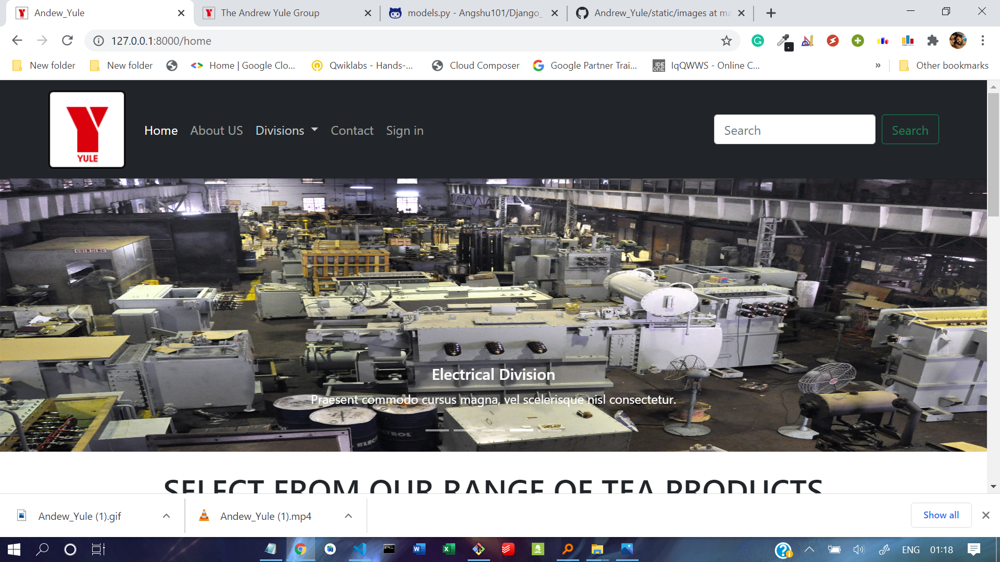

# Andrew_Yule
GETTING STARTED

<h2>Tea Company</h2>

Andrew Yule celebrated its centenary year in 1963. However, post-1963 era had been a period of dramatic change both in structural fabric and fortunes of the Company. 
Managing agency system was abolished in 1969, coal and insurance were nationalized, jute business was sold in early 70s and the Group shrunk considerably. There was great deal of uncertainty about the future of the Company. It was in this background that the Government of India decided to acquire its 49% foreign shareholdings to provide stability to the organization. Government subsequently acquired another 2% from the market and thus, Andrew Yule & Co. Ltd. became a public sector enterprise in 1979.
The present business of the Andrew Yule Group includes Tea, Electrical, Engineering, Lubricant, Printing, Digital Communication etc. 
Various changes in the economic situation as well as socio-economic conditions for 150 years could never dampen the tradition and heritage 
of the Company and its business growth. The Company always had the resilience to withstand the vicissitudes and the test of time.
The recent example was the remarkable turnaround by the Company in 2007 for which it received the SCOPE Excellence Award for the turnaround category. 
Today, the Andrew Yule Group has a turnover of Rs.1,200 crore and it employs about 16,500 people.

1 - Install requirements
  pip install -r requirements.txt
 
2 - Runserver on port 8000

    python manage.py runserver
    
    http://127.0.0.1:8000/
    
3 - Create superuser
    python manage.py createsuperuser
    

